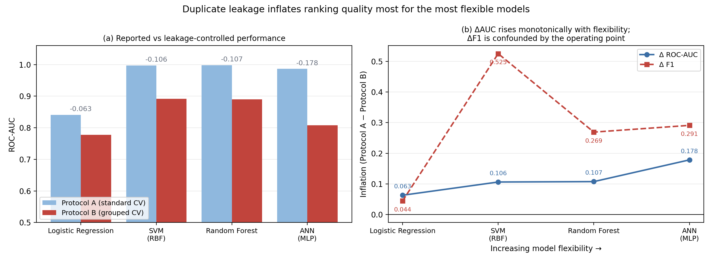
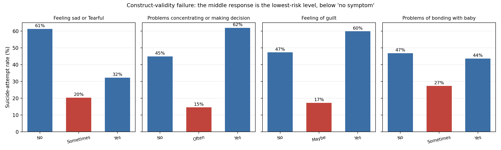

# A Data-Quality and Leakage Audit of the Public Postpartum-Depression Survey Benchmark

*Draft section. Figures referenced as `results/*.png`; all numbers reproducible via
`ppd_preprocessing.py`, `ppd_model_comparison.py`, `ppd_audit.py`.*

---

## 1. Motivation

The Kaggle "PostPartum Depression" survey is the most frequently used public structured
dataset in computational PPD research, and reported accuracies on it routinely approach or
exceed 99%. We set out to use it to train and validate the structured/clinical branch of a
multimodal architecture. Instead, auditing it produced a result we consider more useful: the
benchmark cannot support the performance claims made on it, and the standard evaluation
protocol applied to it is invalid.

We report four findings.

1. **Effective sample size.** The file does not behave like a sample of independent
   respondents. Its 1,168 analysable rows contain 248 distinct questionnaire answers, and the
   long tail of one-off responses that any real survey produces is absent.
2. **Leakage inflation, coupled to model capacity.** Because duplicated respondents straddle
   a random train/test split, reported scores are inflated — and the inflation grows with
   model flexibility, so the published *ranking* of models is an artifact of the split rather
   than a property of the models.
3. **Construct validity.** Symptom–outcome relationships are non-monotone, and in four of
   eight items the middle response level carries lower risk than reporting no symptom at all.
4. **Operating point dominates model choice.** For screening use, the decision threshold
   changes recall far more than the choice of classifier does.

We release corrected reference baselines under a leakage-controlled protocol, and recommend
that protocol as the default for survey-derived mental-health datasets.

## 2. Dataset and target

The dataset comprises 1,503 self-administered Google Form responses: an age bracket and nine
categorical symptom items. Following prior work we take `Suicide attempt` as the target — a
coarse severity proxy, not a clinical diagnosis. Its `Not interested to say` responses
(*n* = 335) are non-response rather than a third class and are dropped, leaving **1,168 rows
at a 39.3% positive rate**.

Preprocessing canonicalises the instrument's inconsistent option wording. Notably, the
appetite item offers both `No` and `Not at all` — the same answer recorded under two labels —
which we merge. Imputation (27 missing cells, 0.18%) and scaling are fitted inside training
folds only. Full detail is in `results/preprocessing_report.md`.

## 3. Finding 1 — the benchmark has an effective sample size of ~248

The nine items admit **14,580** possible response combinations, against 1,168 rows. Yet the
data contains only **248 distinct response patterns**: 920 of 1,168 rows (78.8%) duplicate
another row, and one pattern recurs 33 times.

Duplication alone is not proof of a problem — a coarse instrument produces collisions. The
diagnostic is the *shape* of the repeat distribution. We apply two tests.

**Test 1 — independent respondents.** We simulate 1,168 respondents answering independently,
drawing each item from its own observed marginal distribution (500 replicates). This preserves
every univariate distribution exactly.

**Test 2 — iid draws from the observed pattern distribution.** This grants the observed
pattern frequencies entirely and asks only whether the *counts* look like random sampling: we
draw 1,168 rows from the empirical distribution over the 248 observed patterns (500
replicates). This test makes **no independence assumption** about the items and is therefore
immune to the objection that symptom items are correlated.

| Statistic | Observed | Test 2: iid from same patterns | Test 1: independent respondents |
|---|---|---|---|
| Distinct response patterns | **248** | — | 1,080 [1,055–1,104] |
| Patterns occurring exactly once | **1** | 39 [26–54] | 999 [948–1,045] |
| Max repeats of one pattern | **33** | — | ~3 |

*Figure 1. The benchmark does not behave like independent respondents. (a) Observed pattern
diversity against the independence simulation. (b) Singleton patterns, log scale — observed,
against both nulls. (c) The empirical repeat distribution begins at two, not one.*

The independence simulation predicts ~999 one-off patterns; the file contains **one**. Item
correlation reduces diversity and so weakens Test 1 — but the observed inter-item association
is weak (Cramér's V mostly ≈0.2, maximum 0.51), nowhere near enough to close a gap of this
size. Test 2 removes the assumption altogether and still rejects: granting the pattern
frequencies exactly, random sampling yields 39 singletons [26–54], and the observed value of 1
lies far outside that interval. The repeat-count variance is additionally under-dispersed
relative to multinomial sampling, though only mildly (1.2×); the singleton deficit, not the
dispersion, is the decisive signal.

The pattern is what one expects from a limited pool of templates replicated to inflate the row
count, rather than from 1,503 independently sampled respondents. **The effective sample size
is the number of distinct questionnaires — 248 — not 1,503.** Every downstream claim about
statistical power, and every model complexity decision, should be made against that number.

## 4. Finding 2 — leakage inflation scales with model capacity

Because 78.8% of rows duplicate another row, a random train/test split places near-identical
questionnaires on both sides. We therefore evaluate every model twice, under nested
cross-validation (outer 5-fold scoring, inner 3-fold grid search on ROC-AUC):

- **Protocol A** — standard stratified 5-fold CV. This is what the literature reports.
- **Protocol B** — `StratifiedGroupKFold` with the group defined as the unique response
  pattern, so identical questionnaires can never span a split.

*Figure 2. Identical models and data under the two protocols. Under Protocol A the nonlinear
models are near-perfect; under Protocol B the same models lose most of that separation.*

**Table 1. Protocol A (as reported in the literature) vs Protocol B (leakage-controlled).**
Mean ± SD across outer folds.

| Model | Acc (A) | AUC (A) | F1 (A) | Acc (B) | AUC (B) | F1 (B) |
|---|---|---|---|---|---|---|
| Logistic Regression | 0.754 | 0.841 | 0.695 | 0.729 | 0.778 | 0.651 |
| SVM (RBF) | 0.991 | 0.997 | 0.989 | 0.724 | 0.891 | 0.464 |
| Random Forest | 0.986 | 0.998 | 0.983 | **0.784** | 0.890 | **0.714** |
| ANN (MLP) | 0.962 | 0.986 | 0.952 | 0.727 | 0.808 | 0.661 |

**Table 2. Inflation attributable to duplicate leakage (Protocol A − Protocol B).**

| Model | ΔAUC | ΔF1 | ΔAccuracy |
|---|---|---|---|
| Logistic Regression | 0.063 | 0.044 | 0.025 |
| SVM (RBF) | 0.106 | 0.525 | 0.267 |
| Random Forest | 0.107 | 0.269 | 0.202 |
| ANN (MLP) | **0.178** | 0.291 | 0.235 |

*Figure 3. (a) Reported vs leakage-controlled AUC per model, annotated with the loss.
(b) ΔAUC rises monotonically with model flexibility; ΔF1 is confounded by the operating
point.*

Two observations follow.

**The inflation is not uniform.** Logistic regression loses 0.063 AUC; the MLP loses 0.178 —
close to three times as much. Ordering the models by nominal flexibility
(LR < SVM-RBF < RF < MLP), ΔAUC is monotone increasing. We do not over-read a rank correlation
computed on four points, and the SVM and Random Forest values are effectively tied
(0.106 vs 0.107); the robust statement is that the *least* flexible model inflates least and
the *most* flexible inflates most. The mechanism is straightforward: capacity to memorise
becomes an advantage exactly when the test set contains rows the model has already seen.

**The published ranking is therefore an artifact.** Under Protocol A, the SVM and Random
Forest appear to dominate logistic regression by roughly 0.16 AUC — a gap that would justify
strong claims about nonlinearity in PPD risk. Under Protocol B that gap falls to ~0.11, and
the SVM's F1 collapses from 0.989 to 0.464. The confusion matrices give the sharpest view: the
RBF-SVM goes from **4 false negatives to 318**, missing 69% of at-risk mothers.

We note that ΔF1 is *not* monotone in capacity (the SVM's 0.525 is the largest value in the
table). This is a threshold artifact rather than a capacity effect, and is treated separately
in §6. ΔAUC, being threshold-free, is the appropriate measure of the leakage effect.

**Implication for deep learning.** At an effective *n* of 248, model capacity is a liability
rather than an asset on this branch. The MLP both inflates most under leakage and ranks
second-worst once leakage is controlled (AUC 0.808). We state this plainly because it runs
against the framing of our own architecture: the structured branch of a PPD model does not
warrant a deep network, and reported deep-learning gains on this benchmark should be treated
as unverified until reproduced under a grouped protocol.

## 5. Finding 3 — inverted symptom–risk relationships

Five of eight symptom items are non-monotone in severity. In four, the **middle** response
level carries a *lower* attempt rate than reporting no symptom at all.

| Item | No symptom | Middle level | Full symptom |
|---|---|---|---|
| Feeling sad or tearful | **0.61** | 0.20 | 0.32 |
| Problems concentrating | 0.45 | **0.15** | 0.62 |
| Feeling of guilt | 0.47 | **0.17** | 0.60 |
| Problems bonding with baby | 0.47 | **0.27** | 0.44 |

*Figure 4. In four items the middle response is the lowest-risk level, below "no symptom".*

Respondents reporting *no* sadness show a 0.61 attempt rate against 0.20 for those reporting
"sometimes" — a threefold inversion of the clinically expected direction. A screening
instrument in which denying a symptom predicts higher risk than endorsing it moderately is not
measuring symptom severity in the intended way.

Two further items — `Feeling anxious` and `Overeating or loss of appetite` — have no
detectable association with the target at all (χ² p ≈ 0.73 and 0.75; Cramér's V = 0.000),
despite anxiety being among the most robust correlates of postpartum depression in the
clinical literature.

This pattern is also visible in the models: under one-hot encoding the Random Forest ranks
`Problems concentrating = Often` and `Feeling of guilt = Maybe` as its second and third most
important features. It is the reason we one-hot encode rather than treat the items as ordinal
— an ordinal encoding would impose a monotonicity the data does not exhibit.

We do not claim to identify the cause. Middle-option response styles, satisficing, and
artifacts introduced by whatever process generated the duplicate structure in §3 are all
consistent with what we observe. The consequence for practice is the same either way: the
item-level responses should not be interpreted as a severity scale.

## 6. Finding 4 — the operating point dominates model choice

At the default 0.5 threshold the RBF-SVM attains 0.971 precision with **0.307 recall**,
missing 318 of 459 at-risk mothers. Selecting the decision threshold on training folds only
(maximising F1 within the inner CV) changes this substantially:

| Model | Recall @ 0.5 | Recall @ tuned | F1 @ 0.5 | F1 @ tuned | Threshold |
|---|---|---|---|---|---|
| SVM (RBF) | 0.307 | **0.862** | 0.464 | 0.745 | 0.43 |
| Random Forest | 0.686 | 0.840 | 0.714 | **0.748** | 0.36 |
| ANN (MLP) | 0.674 | 0.749 | 0.661 | 0.675 | 0.42 |
| Logistic Regression | 0.653 | 0.678 | 0.651 | 0.595 | 0.43 |

Moving the SVM's threshold changes recall by 0.555, while the spread in recall *across all
four models* at a fixed threshold is 0.379. For a screening instrument — where a false
negative is a missed at-risk mother and a false positive is a follow-up conversation — the
default threshold is the wrong operating point, and accuracy at that threshold is the wrong
headline metric. We recommend that screening work on this task report decision-curve or
net-benefit analysis at explicit cost ratios rather than threshold-fixed accuracy.

## 7. Recommended protocol and corrected baselines

For survey-derived mental-health datasets we recommend that evaluation **group on the unique
feature pattern**, not on the row. Concretely: compute a hash of the feature vector, use it as
the group key in `StratifiedGroupKFold`, and report the resulting scores as primary. Where
comparison with prior work is needed, report the standard-split figure alongside it and label
it as such.

The corrected reference baselines for this dataset are the Protocol B columns of Table 1. The
honest ceiling is **≈0.89 AUC and ≈0.75 F1**, attained by the Random Forest at a tuned
threshold — not the ~0.99 accuracy widely reported.

We recommend this dataset be treated as an **audit object rather than as training data**. For
work requiring a genuine structured branch, a population survey with clinical labels (e.g.
PRAMS) or an EPDS-labelled cohort is the appropriate substitute.

## 8. Implication for the multimodal architecture

This audit changes the empirical footing of the multimodal design rather than undermining it.
The structured branch's honest ceiling (≈0.89 AUC / ≈0.75 F1) is measured on a **concurrent**
severity proxy: the target is co-reported with the symptoms used to predict it, within a single
questionnaire. That is screening, not anticipation. The claim that a structured symptom
inventory is insufficient for anticipatory PPD detection therefore moves from a motivating
assertion to a measured result, and Protocol B supplies the floor that any text or multimodal
branch must clear to justify its complexity.

## 9. Limitations

- `Suicide attempt` is a self-reported severity proxy, not a clinical diagnosis, and it is
  predicted from symptoms co-reported in the same instrument.
- Test 1 in §3 assumes inter-item independence and therefore overstates expected diversity.
  Test 2 does not rely on that assumption and is the claim we rest on.
- We characterise the duplicate structure as inconsistent with independent sampling. We do not
  have provenance information for the file and therefore do not assert *how* it was produced.
- The capacity ordering in §4 is a nominal one; with four models we report the endpoints rather
  than a rank statistic.
- The threshold analysis in §6 optimises F1. A deployment would select the operating point
  against an explicit clinical cost ratio instead.
