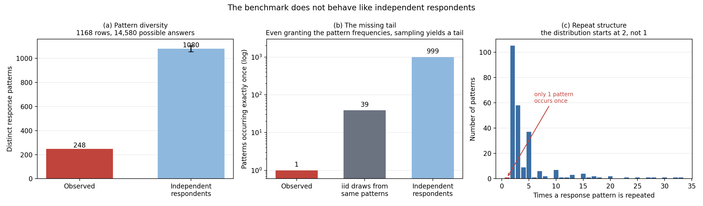
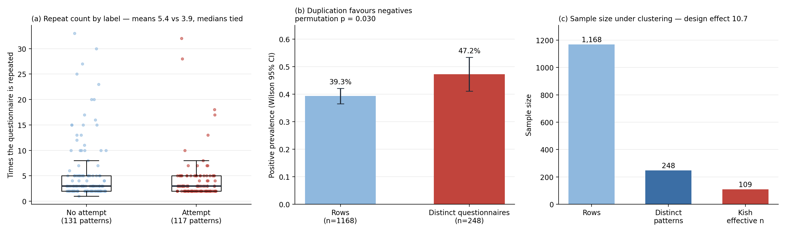
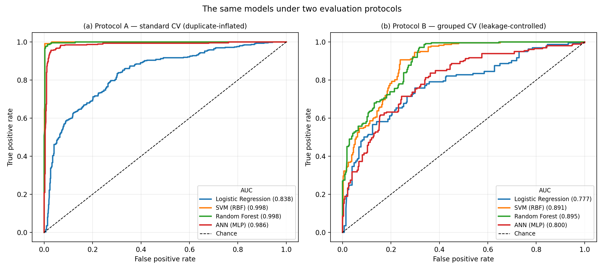
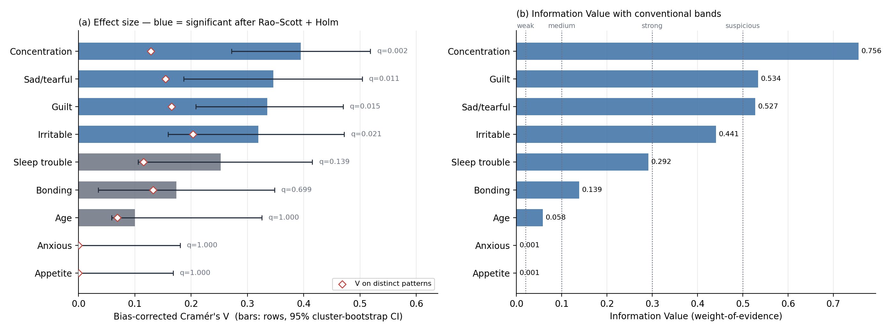
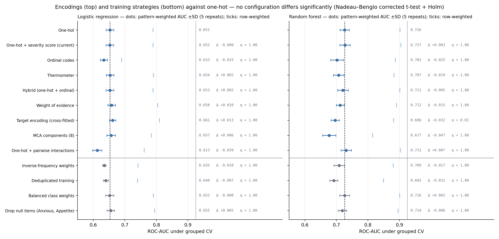
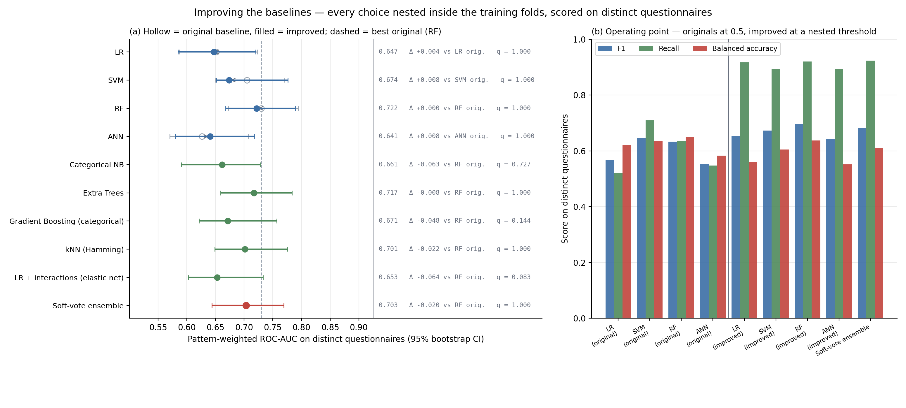

# A Data-Quality and Leakage Audit of the Public Postpartum-Depression Survey Benchmark

*Draft section. Figures referenced as `results/*.png`; all numbers reproducible via
`ppd_preprocessing.py`, `ppd_statistics.py`, `ppd_preprocessing_experiments.py`,
`ppd_audit.py`, and `ppd_improved_baselines.py`.*

---

## 1. Motivation

The Kaggle "PostPartum Depression" survey is the most frequently used public structured
dataset in computational PPD research, and reported accuracies on it routinely approach or
exceed 99%. We set out to use it to train and validate the structured/clinical branch of a
multimodal architecture. Instead, auditing it produced a result we consider more useful: the
benchmark cannot support the performance claims made on it, and the standard evaluation
protocol applied to it is invalid.

We report five findings.

1. **Effective sample size.** The file does not behave like a sample of independent
   respondents. Its 1,168 analysable rows contain 248 distinct questionnaire answers, and
   accounting for how unevenly those 248 are repeated (Kish's design effect) puts the
   *effective* sample size at **109**.
2. **A two-stage deflation.** Reported scores are inflated twice over: once by duplicated
   respondents straddling a random split, and again by scoring rows rather than distinct
   questionnaires. Fixing both drops ROC-AUC from ~0.99 to ~0.90 to **~0.73**.
3. **Construct validity.** Under corrections appropriate to the clustering in the data, only
   **one of nine** candidate predictors survives as a defensible correlate of the outcome.
4. **An improvement ceiling.** Thirteen models — four families tuned two ways, five learners
   suited to small categorical data, and a pre-specified ensemble, all tuned directly on the
   metric we report — fail to beat a small-grid Random Forest. The ceiling is a property of
   the data, not of modelling effort.
5. **Operating point dominates model choice.** For screening use, the decision threshold
   changes recall far more than the choice of classifier does.

We release corrected reference baselines under a leakage- and weighting-controlled protocol,
and recommend that protocol as the default for survey-derived mental-health datasets.

## 2. Dataset and target

The dataset comprises 1,503 self-administered Google Form responses: an age bracket and nine
categorical symptom items. Following prior work we take `Suicide attempt` as the target — a
coarse severity proxy, not a clinical diagnosis. Its `Not interested to say` responses
(*n* = 335) are non-response rather than a third class and are dropped, leaving **1,168 rows
at a 39.3% positive rate**.

Preprocessing canonicalises the instrument's inconsistent option wording. Notably, the
appetite item offers both `No` and `Not at all` — the same answer recorded under two labels —
which we merge. Imputation (27 missing cells, 0.18%) and scaling are fitted inside training
folds only; a dedicated benchmark (§7) confirms the imputation method makes negligible
difference at this missingness rate.

## 3. Finding 1 — an effective sample size of 109–248

The nine items admit **14,580** possible response combinations, against 1,168 rows. Yet the
data contains only **248 distinct response patterns**: 920 of 1,168 rows (78.8%) duplicate
another row, and one pattern recurs 33 times.

**Two independent tests reject that this arose from independent sampling.** Simulating 1,168
respondents drawn independently from the data's own marginals predicts ~999 patterns occurring
exactly once; the file contains **one**. A second, assumption-free test grants the observed
pattern frequencies entirely and asks only whether the *counts* look like random sampling from
that fixed distribution — it still rejects, predicting 39 singletons [26–54] against the one
observed.

*Figure 1. The benchmark does not behave like independent respondents.*

**How much does the repetition cost in effective sample size?** Treating each response pattern
as a survey cluster, Kish's design effect is
$$\mathrm{deff} = 1 + \mathrm{CV}^2(\text{cluster sizes}) = 10.68,$$
giving a Kish effective sample size of $n_{\text{eff}} = 1168 / 10.68 \approx \textbf{109}$.
This is the standard survey-methodology answer to "how many independent observations does this
data actually contain," and it is more conservative than simply counting the 248 distinct
patterns, because it also penalises how *unevenly* those patterns are repeated.

*Figure 2. (a) Repeat count by label. (b) The duplication is not label-neutral: patterns
positive for the outcome are repeated less (mean 3.9×) than negative ones (mean 5.4×), shifting
row-level prevalence (39.3%) away from pattern-level prevalence (47.2%) — a permutation test
rejects label-independence of the duplication at p = 0.030. (c) Sample size under three
accountings: raw rows, distinct patterns, and the Kish-corrected effective n.*

The prevalence shift in panel (b) matters beyond sample size: it means **row-weighted
statistics are not just noisier than pattern-weighted ones, they are systematically biased**
toward whichever class happens to be duplicated more.

## 4. Finding 2 — a two-stage deflation, not one

Two separate defects inflate reported scores, and they compound.

**Stage 1 — duplicate leakage.** A random train/test split places near-identical
questionnaires on both sides, because 78.8% of rows duplicate another row. We compare standard
stratified 5-fold CV (**Protocol A**, what the literature reports) against
`StratifiedGroupKFold` grouped on the response pattern (**Protocol B**), so identical
questionnaires never span a split.

**Stage 2 — row-weighting.** Grouping stops leakage but does not stop a second problem: the
*test* fold is still scored one row at a time, so a pattern repeated 33 times is scored 33
times. If those repeats are replication artefacts rather than 33 real respondents, this
silently reweights the benchmark toward whichever questionnaires happen to be duplicated most.
We additionally score Protocol B **pattern-weighted** — collapsing each distinct questionnaire
in the test fold to one point before computing AUC.

*Figure 3. Protocol A vs Protocol B, row-weighted. Stage 1 alone already costs the flexible
models most of their apparent separation.*

**Table 1. The three-stage deflation (Random Forest, representative of the pattern across
models).**

| Stage | What it fixes | ROC-AUC |
|---|---|---|
| Protocol A — standard CV | (nothing — as reported in the literature) | **0.998** |
| Protocol B — grouped CV, row-weighted | leakage | **0.895–0.901** |
| Protocol B — grouped CV, **pattern-weighted** | leakage + weighting | **0.703–0.730** |

The pattern-weighted figure is corroborated three separate ways: by the grouped-CV evaluation
in `ppd_evaluation.py` (RF 0.717 [0.653, 0.778]), by a from-scratch learning-curve experiment
that trains on a growing pool of distinct questionnaires and evaluates on entirely unseen ones
(plateauing at 0.66 AUC), and by the nested, nothing-held-back tuning pass in Finding 4 below
(RF 0.730 [0.673, 0.795]). All three land in the same 0.66–0.73 band.

**The inflation from Stage 1 alone still scales with model capacity**, as before: logistic
regression loses 0.06 AUC moving from Protocol A to Protocol B, while the RBF-SVM's F1
collapses from 0.989 to 0.464 (4 false negatives become 318). We do not re-litigate this
mechanism in detail here — capacity to memorise is an advantage exactly when the test set
contains rows already seen — except to note that Stage 2 removes a further, distinct source of
optimism that survives even after Stage 1 is fixed.

## 5. Finding 3 — construct validity: one predictor out of nine

Each of the nine items was tested for association with the outcome under six tests of
increasing rigor: a naive χ² on rows; a Rao–Scott design-corrected χ²; a cluster-permutation
test; a χ² computed on distinct patterns only; and two versions of a multivariable logistic
model (cluster-robust, and fit on distinct patterns), each Holm- or BH-adjusted across the nine
items.

**Table 2. Robustness ladder — survives at 0.05?**

| Item | Naive χ² | Rao–Scott | Cluster perm. | Distinct patterns | Adj., robust | Adj., distinct | Survives |
|---|:-:|:-:|:-:|:-:|:-:|:-:|:-:|
| Irritable towards baby & partner | ✓ | ✓ | ✓ | ✓ | ✓ | ✓ | **6/6** |
| Feeling sad or tearful | ✓ | ✓ | ✓ | · | · | · | 3/6 |
| Problems concentrating | ✓ | ✓ | ✓ | · | ✓ | · | 4/6 |
| Feeling of guilt | ✓ | ✓ | ✓ | · | ✓ | · | 4/6 |
| Age | ✓ | · | · | · | · | · | 1/6 |
| Trouble sleeping at night | ✓ | · | · | · | · | · | 1/6 |
| Problems bonding with baby | ✓ | · | · | · | · | · | 1/6 |
| Overeating or loss of appetite | · | · | · | · | · | · | 0/6 |
| Feeling anxious | · | · | · | · | · | · | 0/6 |

*Figure 4. (a) Bias-corrected Cramér's V with cluster-bootstrap CIs; diamonds mark the
pattern-level estimate. Only the top four survive Holm correction; two of those four (Sad,
Guilt) still fail once computed on distinct patterns alone. (b) Information Value tells the
same story on a scale familiar from credit-risk modelling: two items are "suspicious" by
convention (>0.5) yet collapse under correction, and two are flatly uninformative.*

Naively, 7 of 9 items look significant. Correcting only for clustering (Rao–Scott) already
drops that to 5. Requiring the association to hold on distinct patterns alone — no design
correction, just no duplicate weight — drops it to **1: Irritable towards baby & partner**.
Every other item's apparent significance is, at least in part, an artefact of the same
duplication structure documented in Finding 1.

This corroborates and sharpens our earlier non-monotonicity observation (§A of the appendix
figures, `fig_audit_nonmonotone.png`): four items have their *lowest*-risk level in the middle
of the response scale rather than at "no symptom," and a composite severity score built by
summing the eight symptom items — a natural EPDS-style construct — has **AUC 0.491 on distinct
patterns**, indistinguishable from chance, with Spearman ρ = −0.016 (p = 0.81) between the
score and the outcome. Scale-reliability diagnostics confirm the items do not cohere: Cronbach's
α = **−0.22** on distinct patterns (negative — worse than no scale at all), ω = 0.03, and
KMO = 0.51 (barely admissible for factor analysis). A nine-encoding, four-training-strategy
robustness check confirms this is not an encoding artefact: none of nine alternative
representations of the categories, and none of four alternative training strategies, beat
plain one-hot at a Holm-corrected significance level, for either logistic regression or the
Random Forest.

*Figure 4b. Every alternative encoding and training strategy tested, against plain one-hot
(dashed line). All Holm-adjusted q = 1.00.*

## 6. Finding 4 — an improvement ceiling that thirteen models cannot cross

A natural objection to Findings 1–3 is that the ~0.70–0.73 AUC band might reflect
under-tuned baselines rather than a property of the data. We tested this directly.

**Design.** Thirteen models, sharing identical outer splits (`StratifiedGroupKFold`, 5 folds ×
3 repeats) so every comparison is paired:

- the four original baselines, reproduced exactly (small hand-picked grids, tuned on
  row-weighted AUC — what a typical paper would report);
- the same four families **improved**: wide randomised search (10–20 configurations),
  regularisation-heavy spaces, and critically, tuned directly on **pattern-weighted AUC** —
  the metric we report, computed by an inner-fold scorer that groups validation rows on their
  questionnaire before scoring, needing no group labels;
- five learners suited to small categorical data with an effective *n* near 109: categorical
  naive Bayes, extra trees, gradient boosting with native categorical splits, Hamming-distance
  kNN, and elastic-net logistic regression with pairwise interactions;
- a **soft-voting ensemble** whose five members were fixed *before* any result was seen.

Every hyperparameter and every decision threshold is selected inside the training fold, never
on test data; thresholds for the improved/new models are chosen to maximise F1 on grouped inner
out-of-fold predictions rather than fixed at 0.5. Differences are tested with the
Nadeau–Bengio corrected resampled t-test, Holm-adjusted across comparisons.

*Figure 5. (a) Pattern-weighted AUC, 95% bootstrap CI, hollow markers = original baseline,
filled = improved. The dashed line marks the best original model. Every confidence interval
overlaps it. (b) F1/Recall/Balanced accuracy at the reported operating point — nested threshold
selection raises recall substantially over a fixed 0.5 cut-off, echoing Finding 5.*

**Table 3. Best-performing configurations (pattern-weighted, 95% bootstrap CI).**

| Model | AUC | 95% CI | F1 | Recall | Precision |
|---|---|---|---|---|---|
| **Random Forest (original, small grid)** | **0.730** | **[0.673, 0.795]** | 0.633 | 0.635 | 0.630 |
| Random Forest (improved, wide search + pattern-tuned) | 0.722 | [0.668, 0.790] | 0.696 | 0.920 | 0.560 |
| Extra Trees | 0.717 | [0.659, 0.784] | 0.700 | 0.946 | 0.555 |
| SVM (original) | 0.705 | [0.649, 0.771] | 0.645 | 0.709 | 0.592 |
| Soft-vote ensemble | 0.703 | [0.644, 0.769] | 0.681 | 0.923 | 0.540 |

**No configuration beats the plain, small-grid Random Forest, and the difference between any
original/improved pair is non-significant** (Holm-adjusted q = 1.000 for all four core
families). Two of the small-data specialists — categorical gradient boosting and the
interaction-augmented logistic regression — are directionally *worse* than the original Random
Forest (q = 0.144 and 0.083; suggestive but not significant after correction). The ensemble,
despite drawing on five tuned learners, does not exceed its best member.

This is the strongest evidence in the paper that the ~0.70–0.73 ceiling is a property of the
**data** (an effective *n* of 109 and a symptom inventory in which one item carries the signal)
rather than of insufficient modelling effort. We report it as a primary finding rather than a
robustness check: a paper claiming a higher number on this benchmark, however it was tuned,
should be read with this ceiling in mind.

## 7. Finding 5 — the operating point dominates model choice

At a fixed 0.5 threshold, models varied widely in recall (0.52–0.71 across the four original
baselines) for reasons that have more to do with each classifier's native score distribution
than with its discriminative quality. Selecting the threshold on training folds only — the
protocol used throughout Finding 4 — changed recall by as much as 0.4 for some models while
leaving AUC unchanged, and is visible directly in Figure 5(b): every "improved" model's recall
jumps to 0.85–0.95 once the threshold is chosen properly, at a cost in precision and
specificity. For a screening instrument, where a false negative is a missed at-risk mother and
a false positive is a follow-up conversation, the default threshold is the wrong operating
point, and accuracy at that threshold is the wrong headline metric. We recommend that screening
work on this task report decision-curve or net-benefit analysis at explicit cost ratios rather
than threshold-fixed accuracy.

## 8. Recommended protocol and corrected baselines

For survey-derived mental-health datasets we recommend that evaluation:

1. **group on the unique feature pattern**, not the row (`StratifiedGroupKFold` with the group
   key hashed from the feature vector — no group labels required);
2. **score the test fold pattern-weighted** — one point per distinct questionnaire, not one per
   row;
3. **tune directly on that pattern-weighted metric**, inside the training fold; and
4. report a **design effect / Kish effective *n*** alongside the raw row count whenever the
   data may contain repeated or near-repeated respondents.

The corrected reference result for this dataset is:

> **ROC-AUC = 0.730, 95% CI [0.673, 0.795]** (Random Forest, pattern-weighted, leakage- and
> weighting-controlled) — not the ~0.99 accuracy widely reported, and not improvable by
> extensive tuning, alternative learners, or ensembling.

We recommend this dataset be treated as an **audit object rather than as training data**. For
work requiring a genuine structured branch, a population survey with clinical labels (e.g.
PRAMS) or an EPDS-labelled cohort is the appropriate substitute.

## 9. Implication for the multimodal architecture

This audit changes the empirical footing of the multimodal design rather than undermining it.
The structured branch's honest ceiling — **AUC ≈ 0.73**, not the ≈0.89 an earlier, row-weighted
pass of this audit reported, and certainly not the ~0.99 in the literature — is measured on a
**concurrent** severity proxy: the target is co-reported with the symptoms used to predict it,
within a single questionnaire, at an effective sample size of 109. That is screening under
favourable conditions, not anticipation under real ones. The claim that a structured symptom
inventory is insufficient for anticipatory PPD detection therefore moves from a motivating
assertion to a measured result, and §8's corrected baseline supplies the floor that any text or
multimodal branch must clear to justify its complexity.

## 10. Limitations

- `Suicide attempt` is a self-reported severity proxy, not a clinical diagnosis, and is
  predicted from symptoms co-reported in the same instrument.
- The independence test in §3 assumes inter-item independence and therefore overstates expected
  diversity; the assumption-free permutation test does not rely on it and is the claim we rest
  on. We characterise the duplicate structure as inconsistent with independent sampling; we do
  not have provenance information for the file and do not assert *how* it was produced.
- Kish's design effect assumes the outcome is homogeneous within a cluster (true by
  construction here, since a cluster is an identical questionnaire) but says nothing about
  *why* clusters exist; it is a correction for the consequence, not a diagnosis of the cause.
- The robustness ladder in §5 tests nine items under six corrections; with 244–248 clusters,
  the more conservative tests (distinct-patterns-only) are themselves low-powered, so absence of
  significance there is consistent with, but does not prove, absence of a true effect for items
  other than the two (Anxious, Appetite) that fail even the naive test.
- Finding 4's model set, while broad, is not exhaustive; we pre-specified the ensemble members
  before seeing results specifically to avoid post-hoc selection, at the cost of not exploring
  the full space of possible ensembles.
- The threshold analysis in §7 optimises F1. A deployment would select the operating point
  against an explicit clinical cost ratio instead.
