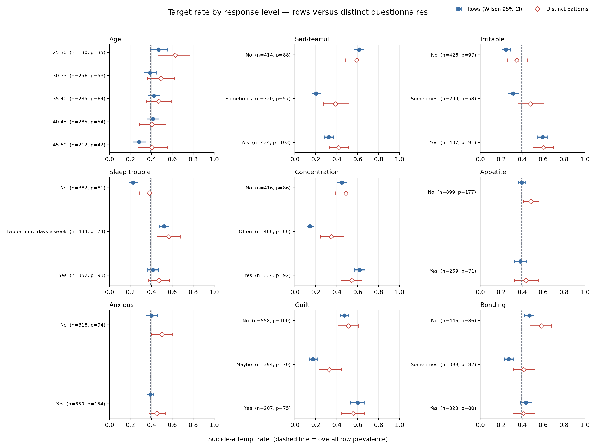
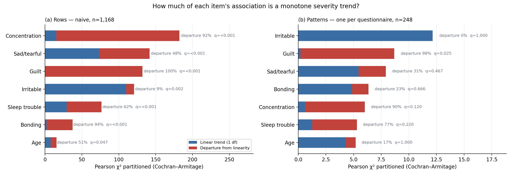
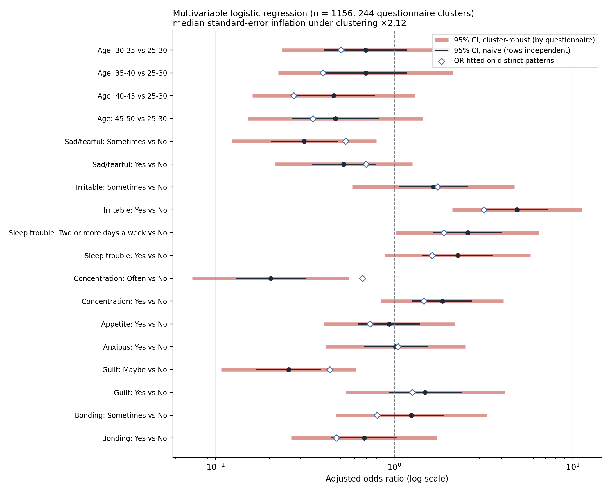
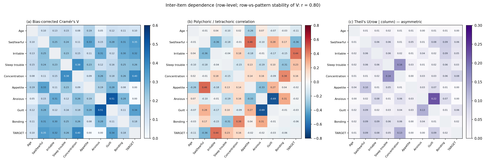
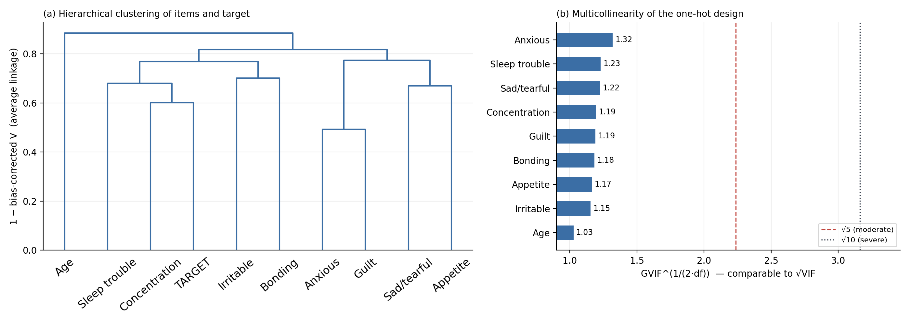
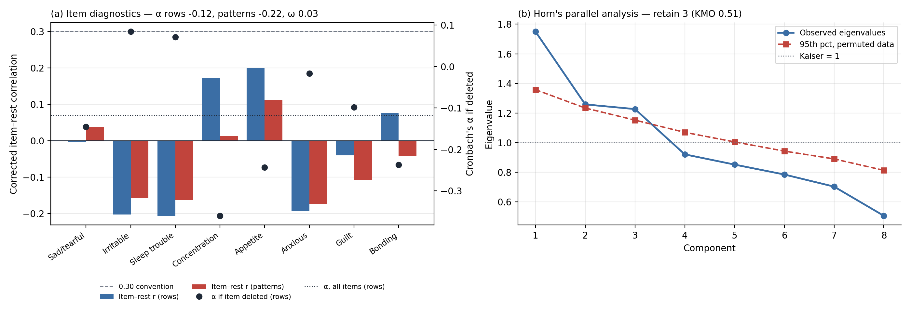
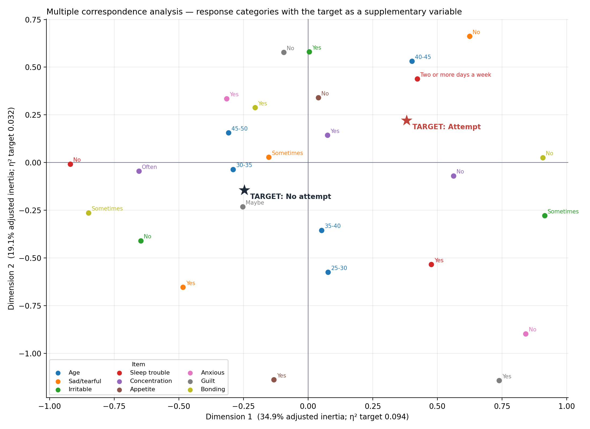
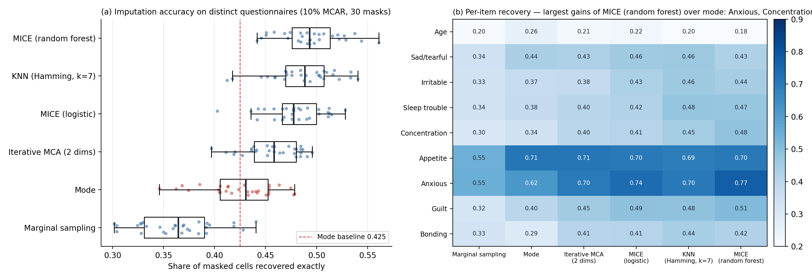

# Statistical Characterisation and Preprocessing of the PPD Survey

*Companion to the benchmark audit. Every number below is produced by `ppd_statistics.py` and
`ppd_preprocessing_experiments.py`; tables in full are in `stats_tables.md` and the
`stats_*.csv` / `prep_*.csv` files.*

**Data:** 1,168 analysed rows (target `Suicide attempt`, Yes/No), 9 categorical items
(age bracket + 8 symptom items), 248 distinct questionnaires.

---

## Key findings

- **Rows are not independent observations.** The Kish effective sample size is **109**
  (design effect 10.7) — smaller even than the 248 distinct questionnaires, because repeat
  counts are unequal. Naive tests on 1,168 rows overstate the evidence roughly tenfold.
- **Only one item–outcome association survives every correction.** On naive row-level
  tests, 7 of 9 items are significant. Under design-corrected, cluster-resampled,
  pattern-level and multivariable cluster-robust analyses, only **Irritable** survives
  all six (and it is the only item with a clean monotone trend).
- **The items do not form a scale.** Cronbach's α is **−0.12** on rows and **−0.22** on
  distinct questionnaires; McDonald's ω is 0.03; 54% of symptom-item pairs covary
  negatively; KMO is 0.51. Validated perinatal depression scales such as the EPDS
  typically report α around 0.8.
- **Anxiety and guilt run in opposite directions** (polychoric r = −0.69). 61% of anxious
  respondents report no guilt, against 14% of non-anxious respondents. The pattern holds on
  distinct questionnaires.
- **The engineered severity score carries no signal** — AUC 0.49 and Spearman ρ = −0.02 on
  distinct questionnaires.
- **Duplication is label-dependent.** Negative questionnaires are repeated more (mean 5.4 vs
  3.9 copies), pulling row-level prevalence to 39.3% against 47.2% on distinct
  questionnaires (permutation p = 0.030).
- **Missing values are replicated.** All 27 missing cells sit in 12 rows that form exactly
  4 distinct questionnaires, each present exactly 3 times with identical blanks.
- **Correction to the manuscript's Finding 3.** Several of the row-level "middle-level
  dips" are exaggerated by duplication. On distinct questionnaires a significant
  non-monotone shape remains for Guilt, with Concentration supported by the multivariable
  analysis; Sadness and Bonding instead show a reversed direction.

---

## 1. The unit of analysis

Identical questionnaires share every feature, so the intraclass correlation of features
within a repeated questionnaire is 1. Treating the repeats as a cluster sample gives Kish's
design effect *deff* = Σ*n*g² / *N* and effective sample size *N* / *deff*.

| Unit | n | Used for |
|---|---|---|
| Rows, as reported in the literature | 1,168 | naive tests — shown for comparison only |
| Distinct questionnaires | 248 | pattern-level tests, pattern-level models |
| Kish effective sample size | **109.3** | Rao–Scott design-effect correction (*deff* = 10.68) |

Every inferential result is therefore computed in up to four ways: naive on rows;
Rao–Scott corrected; on distinct questionnaires; and cluster-robust or cluster-resampled
with the questionnaire as the cluster.

*Duplication is not label-neutral. (a) Repeat counts by label — the medians tie at 3, the
imbalance is in the upper tail, which is why a Mann–Whitney test (p = 0.086) misses it.
(b) The direct test permutes questionnaire labels while holding repeat counts fixed: the
observed row prevalence of 39.5% lies outside the null interval [40.3%, 54.3%], p = 0.030.
(c) Sample size under the three units.*

---

## 2. Column profiles

| Item | Levels | Missing | Mode (share) | Normalised entropy | Gini–Simpson | Imbalance |
|---|---|---|---|---|---|---|
| Age | 5 | 0 | 35-40 (0.24) | 0.979 | 0.788 | 2.19 |
| Sad/tearful | 3 | 0 | Yes (0.37) | 0.992 | 0.661 | 1.36 |
| Irritable | 3 | 6 | Yes (0.38) | 0.988 | 0.658 | 1.46 |
| Sleep trouble | 3 | 0 | Two or more days a week (0.37) | 0.997 | 0.664 | 1.23 |
| Concentration | 3 | 12 | No (0.36) | 0.996 | 0.664 | 1.25 |
| Appetite | 2 | 0 | No (0.77) | 0.779 | 0.355 | 3.34 |
| Anxious | 2 | 0 | Yes (0.73) | 0.845 | 0.396 | 2.67 |
| Guilt | 3 | 9 | No (0.48) | 0.934 | 0.621 | 2.70 |
| Bonding | 3 | 0 | No (0.38) | 0.992 | 0.661 | 1.38 |

Six of the eight symptom items are close to uniform across their levels (normalised
entropy ≥ 0.93). Symptom inventories in clinical and community samples are usually skewed
toward "no symptom"; a near-uniform spread across *No / Sometimes / Yes* is unusual, though
on its own it is not diagnostic.

*Target rate per response level with Wilson 95% intervals, on rows (filled) and on
distinct questionnaires (open). Where the two disagree, the row-level estimate is being
driven by a few heavily repeated questionnaires — most visibly Sad/tearful "Sometimes"
(0.20 on rows, 0.39 on questionnaires) and Concentration "Often" (0.15 vs 0.35).*

---

## 3. Association with the outcome

### 3.1 Robustness ladder

Is the item–outcome association significant at α = 0.05 under each analysis?

| Item | Naive χ² (rows) | Rao–Scott + Holm | Cluster permutation + Holm | Distinct questionnaires + BH | Adjusted, cluster-robust + Holm | Adjusted, distinct questionnaires + Holm | Survives |
|---|---|---|---|---|---|---|---|
| **Irritable** | ✓ | ✓ | ✓ | ✓ | ✓ | ✓ | **6/6** |
| Concentration | ✓ | ✓ | ✓ | · | ✓ | · | 4/6 |
| Guilt | ✓ | ✓ | ✓ | · | ✓ | · | 4/6 |
| Sad/tearful | ✓ | ✓ | ✓ | · | · | · | 3/6 |
| Age | ✓ | · | · | · | · | · | 1/6 |
| Sleep trouble | ✓ | · | · | · | · | · | 1/6 |
| Bonding | ✓ | · | · | · | · | · | 1/6 |
| Appetite | · | · | · | · | · | · | 0/6 |
| Anxious | · | · | · | · | · | · | 0/6 |

Three items — Age, Sleep trouble and Bonding — are significant **only** under the naive
row-level test. Their apparent association is attributable to duplication.

### 3.2 Effect sizes

| Item | V (rows) [95% cluster CI] | V (questionnaires) | Mutual information (bits) | Theil's U(target \| item) | IV (rows) | IV (questionnaires) |
|---|---|---|---|---|---|---|
| Concentration | 0.395 [0.272, 0.518] | 0.129 | 0.122 | 0.126 | 0.756 | 0.099 |
| Sad/tearful | 0.346 [0.187, 0.504] | 0.155 | 0.089 | 0.092 | 0.527 | 0.126 |
| Guilt | 0.335 [0.208, 0.470] | 0.165 | 0.087 | 0.091 | 0.534 | 0.143 |
| Irritable | 0.320 [0.159, 0.472] | **0.204** | 0.075 | 0.078 | 0.441 | **0.198** |
| Sleep trouble | 0.253 [0.106, 0.415] | 0.116 | 0.049 | 0.051 | 0.292 | 0.085 |
| Bonding | 0.174 [0.035, 0.348] | 0.133 | 0.024 | 0.024 | 0.139 | 0.101 |
| Age | 0.100 [0.059, 0.326] | 0.069 | 0.010 | 0.010 | 0.058 | 0.081 |
| Appetite | 0.000 [0.000, 0.168] | 0.000 | 0.000 | 0.000 | 0.001 | 0.008 |
| Anxious | 0.000 [0.000, 0.180] | 0.000 | 0.000 | 0.000 | 0.001 | 0.008 |

V is the bias-corrected Cramér's V (Bergsma, 2013); intervals resample whole
questionnaires (1,000 replicates).

Two things change when duplication is accounted for. Effect sizes shrink by a factor of
two to three — Concentration falls from V = 0.395 to 0.129 — and the **ranking reorders**:
Irritable, fourth on rows, is the strongest item on distinct questionnaires. On rows,
Concentration, Guilt and Sad/tearful reach Information Values above 0.5, the band credit
scoring treats as "suspicious" (too predictive to be plausible). On distinct
questionnaires every Information Value falls into the 0.08–0.20 range: Concentration drops
7.6-fold, from 0.756 to 0.099.

### 3.3 The composite severity score

Summing the eight ordinal symptom codes gives a score with **no relationship to the
outcome**: AUC 0.54 on rows and 0.49 on distinct questionnaires; Spearman ρ = −0.016
(p = 0.81); mean score 6.93 for attempt and 6.86 for no attempt (Mann–Whitney p = 0.81).
Items that individually carry signal cancel out when summed, which is the expected
consequence of the negative inter-item covariances in §6.

---

## 4. Monotonicity

The Cochran–Armitage test partitions Pearson's χ² exactly into a 1-df linear-trend
component and a departure-from-linearity component, giving a formal test of whether
"more symptom" means "more risk".

| Item | Rows: trend share | Rows: departure q (Holm) | Questionnaires: trend z | Questionnaires: trend share | Questionnaires: departure q (Holm) |
|---|---|---|---|---|---|
| Irritable | 0.91 | 0.002 | **+3.48** | 1.00 | 1.000 |
| Guilt | 0.00 | <0.001 | +0.43 | 0.02 | **0.025** |
| Concentration | 0.08 | <0.001 | +0.78 | 0.10 | 0.120 |
| Sleep trouble | 0.38 | <0.001 | +1.12 | 0.23 | 0.220 |
| Sad/tearful | 0.52 | <0.001 | **−2.34** | 0.69 | 0.467 |
| Bonding | 0.06 | <0.001 | **−2.20** | 0.77 | 0.666 |
| Age | 0.49 | 0.047 | −2.07 | 0.83 | 1.000 |

On rows every multi-level item departs significantly from a linear trend. On distinct
questionnaires the picture is narrower and more informative:

- **Guilt** is significantly non-monotone (98% of its association is departure, q = 0.025).
- **Concentration** keeps a large departure share (90%) without reaching significance
  univariately — but the multivariable cluster-robust linearity test rejects linearity
  for both Concentration (q = 0.0006) and Guilt (q = 0.0014).
- **Irritable** is a clean positive trend.
- **Sad/tearful** and **Bonding** are predominantly monotone but in the **reversed**
  direction: reporting the symptom goes with *lower* outcome rates.

### Correction for the manuscript

The manuscript's Finding 3 table uses row-level rates. On distinct questionnaires:

| Item | No symptom | Middle level | Full symptom | Shape on distinct questionnaires |
|---|---|---|---|---|
| Feeling sad or tearful | 0.59 | 0.39 | 0.42 | reversed trend (denial highest) |
| Problems concentrating | 0.49 | 0.35 | 0.54 | middle dip (multivariable q = 0.0006) |
| Feeling of guilt | 0.51 | 0.33 | 0.56 | middle dip (q = 0.025) |
| Problems bonding with baby | 0.58 | 0.41 | 0.41 | reversed trend (denial highest) |

The substance of the finding stands — risk is not a monotone function of reported
severity — but the claim should be stated as two distinct anomalies (middle-level dips in
Guilt and Concentration; reversed direction in Sadness and Bonding), and the row-level
magnitudes (0.20, 0.15, 0.17, 0.27) should be replaced.

---

## 5. Multivariable logistic regression

All nine items entered as categorical (reference = lowest level), complete cases
(n = 1,156 rows, 244 questionnaires). The model is fitted three ways: naive standard
errors, cluster-robust standard errors grouped on the questionnaire, and on distinct
questionnaires.

| Item | df | Naive LR p | Cluster-robust Wald q (Holm) | Distinct-questionnaire LR q (Holm) | Robust linearity q (Holm) |
|---|---|---|---|---|---|
| Irritable | 2 | <0.001 | **0.003** | **0.031** | 1.000 |
| Concentration | 2 | <0.001 | **0.002** | 0.751 | **0.0006** |
| Guilt | 2 | <0.001 | **0.008** | 0.135 | **0.0014** |
| Sad/tearful | 2 | <0.001 | 0.280 | 0.821 | 0.252 |
| Sleep trouble | 2 | <0.001 | 0.494 | 0.821 | 0.721 |
| Bonding | 2 | 0.031 | 1.000 | 0.751 | 1.000 |
| Age | 4 | 0.025 | 1.000 | 0.751 | 1.000 |
| Appetite | 1 | 0.755 | 1.000 | 0.821 | — |
| Anxious | 1 | 0.925 | 1.000 | 0.892 | — |

- Clustering inflates the standard errors by a median factor of **2.12**.
- McFadden's R² is 0.310 on rows but **0.135** on distinct questionnaires: duplication
  more than doubles the apparent explained variation.
- Selected adjusted odds ratios (rows, cluster-robust 95% CI → distinct questionnaires):
  Irritable *Yes vs No* 4.87 [2.11, 11.22] → 3.18 (p = 0.001); Guilt *Maybe vs No*
  0.26 [0.11, 0.61] → 0.44 (p = 0.024); Concentration *Often vs No* 0.20 [0.07, 0.56] →
  **0.67 (p = 0.30)**.

Cluster-robust errors correct the *inference* for duplication but not the *estimand*,
which is still weighted toward the most-copied questionnaires. The Concentration "Often"
effect is the clearest case: highly significant with robust errors, not significant once
each questionnaire counts once.

---

## 6. Dependence between items

- **Items are close to mutually independent.** Of 36 item pairs, only **4** are associated
  after Rao–Scott correction and Holm adjustment, and **2** on distinct questionnaires
  (Anxious × Guilt; Sleep trouble × Concentration). Items on a depression inventory are
  expected to be broadly inter-correlated.
- **Clinically inverted pairs.** Polychoric correlations: Anxious × Guilt **−0.69**;
  Sad/tearful × Irritable −0.36; Sad/tearful × outcome −0.36. The anxiety–guilt
  cross-tabulation on distinct questionnaires: of non-anxious respondents 60% report guilt,
  of anxious respondents 13%.
- **The structure is partly a duplication artifact.** The row-level and
  questionnaire-level Cramér's V matrices correlate at r = 0.80.
- **Estimator check.** Polychoric and Spearman correlations agree in sign on 98% of pairs,
  and the polychoric magnitude is the larger in 89%, as expected when correcting for the
  coarse three-level categorisation.
- **No multicollinearity.** GVIF1/(2·df) is at most 1.32 (Anxious), far below
  the √5 threshold — consistent with near-independent items.

In the association dendrogram the outcome clusters with Concentration and Sleep trouble;
Anxious–Guilt is the tightest pair; Age joins last.

---

## 7. Scale structure

| Statistic | Value | Reading |
|---|---|---|
| Cronbach's α, rows | **−0.118** | negative: items covary negatively on average |
| Cronbach's α, distinct questionnaires | **−0.218** | |
| Ordinal α (polychoric) | −0.114 | mean inter-item polychoric r = −0.013 |
| McDonald's ωtotal (1-factor PAF) | 0.027 | no common factor |
| Corrected item–rest correlations | −0.21 to +0.20 | none reaches the 0.30 convention |
| Kaiser–Meyer–Olkin | 0.51 (items 0.49–0.56) | at the "unacceptable" boundary |
| Bartlett's sphericity (n = 248) | χ²(28) = 482, p < 0.001 | rejects identity — driven by a few strong pairs |
| Horn's parallel analysis | 3 components retained | first eigenvalue 1.75 vs 1.36 under the null |

A negative α is rare and means the items share no common construct: 54% of the 28 symptom
pairs covary negatively. The one-factor loadings make the point — the "factor" is a
bipolar contrast between Guilt (+0.78) and Anxious (−0.79), not a severity dimension.
Bartlett's test rejects sphericity only because a handful of pairs (above all Anxious ×
Guilt) are strongly related; that is not evidence of a scale.

---

## 8. Multiple correspondence analysis

Greenacre-adjusted inertia: dimension 1 **34.9%**, dimension 2 **19.1%**, dimension 3
10.7%. With the outcome projected as a supplementary variable, its correlation ratio with
the first three dimensions is η² = 0.094, 0.032 and 0.095.

The main axes along which questionnaires differ are therefore largely unrelated to the
outcome. "Attempt" sits near *Sad: No*, *Sleep: Two or more days a week* and *Bonding:
No*; "No attempt" near *Guilt: Maybe*, *Concentration: Often* and *Sad: Sometimes* — the
same anomalies as §4, recovered here without a model.

---

## 9. Missingness

- 27 missing cells (0.18%): Irritable 6, Concentration 12, Guilt 9, in 12 rows; 9 of the
  12 rows miss two or more items.
- **The missingness is replicated.** The 12 incomplete rows are exactly 4 distinct
  questionnaires, each present exactly 3 times with the same cells blank. Independent
  respondents do not reproduce identical answers *and* identical omissions three times
  over; this is further direct evidence that rows were copied.
- Missingness is unrelated to the outcome (Fisher exact on questionnaires, p = 1.00).
- Little's MCAR test on distinct questionnaires: d² = 18.4, df = 21, p = 0.62. MCAR is
  not rejected, but with only 3 distinct missingness masks the test has little power, and
  the conclusion should be stated as "no evidence against MCAR".

---

## 10. Advanced preprocessing, evaluated

Every preprocessing choice is tested against alternatives rather than assumed. Model
hyperparameters are fixed and identical across configurations, so differences are
attributable to the preprocessing alone.

### 10.1 Imputation

Masking on rows would let an imputer "recover" a cell by copying its identical duplicate,
which measures duplication rather than imputation. Cells were therefore masked (10%, MCAR,
30 independent masks) on the **244 complete distinct questionnaires**.

| Method | Recovery accuracy | Δ vs mode | Wilcoxon q (Holm) |
|---|---|---|---|
| MICE — random forest | **0.494** ± 0.030 | **+0.069** | <0.001 |
| KNN — Hamming distance, k = 7 | 0.487 ± 0.032 | +0.062 | <0.001 |
| MICE — logistic | 0.479 ± 0.028 | +0.054 | <0.001 |
| Regularised iterative MCA (2 dims) | 0.458 ± 0.026 | +0.033 | <0.001 |
| Mode | 0.425 | — | — |
| Sampling from the marginal | 0.364 ± 0.037 | −0.061 | <0.001 |

Model-based imputation recovers significantly more than the mode. The gains concentrate
where there is inter-item structure to learn from: Anxious (+0.15), Concentration
(+0.14), Bonding (+0.13), Guilt (+0.11). For Age and Appetite no method beats the mode, and
for Sad/tearful the best gain is 0.02. MICE with random forests is the best imputer. In practice the choice cannot
move the downstream results, since only 27 cells (0.18%) are missing.

### 10.2 Encodings and training strategies

Grouped cross-validation (5 folds × 5 repeats, grouped on the questionnaire); primary
metric pattern-weighted AUC; each configuration compared with plain one-hot using the
Nadeau–Bengio corrected resampled t-test, Holm-adjusted within model.

| Configuration | LR pattern AUC | Δ (q) | RF pattern AUC | Δ (q) | RF row AUC |
|---|---|---|---|---|---|
| One-hot | 0.653 | — | 0.726 | — | 0.902 |
| One-hot + severity score | 0.652 | −0.000 (1.00) | 0.727 | +0.003 (1.00) | 0.905 |
| Ordinal codes | 0.633 | −0.015 (1.00) | 0.702 | −0.025 (1.00) | 0.887 |
| Thermometer | 0.654 | +0.002 (1.00) | 0.707 | −0.019 (1.00) | 0.883 |
| Hybrid (one-hot + ordinal) | 0.653 | +0.002 (1.00) | 0.721 | −0.005 (1.00) | 0.902 |
| Weight of evidence | 0.658 | +0.010 (1.00) | 0.712 | −0.015 (1.00) | 0.891 |
| Target encoding (cross-fitted) | 0.661 | +0.013 (1.00) | 0.696 | −0.032 (0.81) | 0.881 |
| MCA components (8) | 0.657 | +0.006 (1.00) | 0.677 | −0.047 (1.00) | 0.815 |
| One-hot + pairwise interactions | 0.613 | −0.039 (1.00) | **0.731** | +0.007 (1.00) | 0.903 |
| Inverse-frequency sample weights | 0.635 | −0.010 (1.00) | 0.709 | −0.017 (1.00) | 0.881 |
| Deduplicated training folds | 0.640 | −0.007 (1.00) | 0.692 | −0.031 (1.00) | 0.850 |
| Balanced class weights | 0.652 | −0.000 (1.00) | 0.726 | +0.002 (1.00) | 0.901 |
| Drop null items (Anxious, Appetite) | 0.655 | +0.005 (1.00) | 0.719 | −0.006 (1.00) | 0.896 |

**No encoding or training strategy differs significantly from plain one-hot**, and none
moves pattern-weighted AUC by more than 0.047. Even that largest difference is not
significant (p = 0.21), so with 248 questionnaires differences of this size cannot be
reliably resolved. Four results are nonetheless informative.

- **The row–pattern gap is near-universal.** Every configuration but one scores 0.10–0.19
  AUC higher on rows than on distinct questionnaires. The inflation belongs to the data,
  not to any preprocessing choice. The exception is instructive (next point).
- **Ordinal encoding costs logistic regression 0.10 row-weighted AUC** (0.690 vs 0.790)
  but only 0.015 on questionnaires, leaving it the one configuration with a small
  row–pattern gap (0.057). A linear severity code can neither represent the non-monotone
  items nor fit individual frequent questionnaires, so it loses most where the inflation
  is — the non-monotonicity of §4, seen through a model.
- **Re-weighting and deduplication shrink the gap but recover no performance.** They cut
  logistic regression's row–pattern gap from 0.137 to about 0.10 without raising
  pattern-weighted AUC: they change *which* questionnaires the model attends to, not how
  much information exists.
- **Target encoding and MCA trend worse for the random forest** (−0.032 and −0.047, not
  significant). Likely reasons, not tested here: target encoding's internal cross-fitting
  is not group-aware, so duplicates can leak across its inner folds within the training
  data; and eight MCA dimensions compress away level-specific effects the forest uses.

**The severity score adds nothing** (+0.003 / −0.000). An earlier impurity-based Random
Forest importance ranked it as the top feature. That ranking reflects the known bias of
impurity importance toward many-valued continuous features, not predictive value, and
should not be reported.

### 10.3 Recommended preprocessing pipeline

| Step | Choice | Evidence |
|---|---|---|
| Unit of evaluation | Group on the questionnaire; report pattern-weighted metrics | §1, §3, §10.2 |
| Canonicalisation | Merge `Not at all` into `No` (appetite item) | same response, two form labels |
| Imputation | Mode inside each training fold; MICE-RF where missingness is non-trivial | §10.1 |
| Encoding | One-hot, no ordering imposed | §4; no alternative better (§10.2) |
| Items | Anxious and Appetite may be dropped for parsimony | 0/6 on the robustness ladder; no loss |
| Engineered score | Omit | §3.3; +0.003 AUC |
| Weighting | None required for discrimination | §10.2 |
| Significance testing | Rao–Scott, cluster-robust, or pattern-level; never naive on rows | §3, §5 |

Preprocessing is not the bottleneck. For a given model, every pipeline tested lands within
0.05 pattern-weighted AUC of one-hot; the ceiling is set by the data.

---

## 11. Implications for the manuscript

1. **Revise Finding 3** using the pattern-level table in §4: two anomalies (middle-level
   dips in Guilt and Concentration; reversed direction in Sadness and Bonding) instead of
   four middle-level inversions, with the row-level magnitudes replaced.
2. **Add the robustness ladder** (§3.1) as the headline statistical result: 7 of 9 items
   look significant on naive rows, 1 of 9 survives every correction.
3. **Strengthen Finding 1** with three new pieces of forensic evidence: the Kish effective
   sample size of 109; replicated missing values (4 questionnaires × 3 copies with
   identical blanks); and label-dependent duplication (p = 0.030).
4. **Add construct-validity evidence:** negative Cronbach's α, ω ≈ 0, 2 of 36 item pairs
   associated, the anxiety–guilt inversion (r = −0.69), and a severity score with no
   signal.
5. **Remove the severity-score importance claim** anywhere it appears (§10.2).
6. **Report inference correctly:** state that item-level p-values are design-corrected or
   cluster-robust, and give the Kish effective n alongside the row count.

---

## Methods references

- Agresti, A. (2013). *Categorical Data Analysis* (3rd ed.). Wiley — Cochran–Armitage
  partition of χ².
- Bergsma, W. (2013). A bias-correction for Cramér's V and Tschuprow's T. *Journal of the
  Korean Statistical Society*, 42(3), 323–328.
- Greenacre, M. (2017). *Correspondence Analysis in Practice* (3rd ed.). CRC Press —
  adjusted MCA inertia.
- Horn, J. L. (1965). A rationale and test for the number of factors in factor analysis.
  *Psychometrika*, 30(2), 179–185.
- Josse, J., Chavent, M., Liquet, B., & Husson, F. (2012). Handling missing values with
  regularized iterative multiple correspondence analysis. *Journal of Classification*,
  29(1), 91–116.
- Kish, L. (1965). *Survey Sampling*. Wiley — design effect and effective sample size.
- Little, R. J. A. (1988). A test of missing completely at random for multivariate data
  with missing values. *JASA*, 83(404), 1198–1202.
- McDonald, R. P. (1999). *Test Theory: A Unified Treatment*. Erlbaum — ω.
- Nadeau, C., & Bengio, Y. (2003). Inference for the generalization error. *Machine
  Learning*, 52(3), 239–281.
- Olsson, U. (1979). Maximum likelihood estimation of the polychoric correlation
  coefficient. *Psychometrika*, 44(4), 443–460.
- Rao, J. N. K., & Scott, A. J. (1981). The analysis of categorical data from complex
  sample surveys. *JASA*, 76(374), 221–230.
- Strobl, C., Boulesteix, A.-L., Zeileis, A., & Hothorn, T. (2007). Bias in random forest
  variable importance measures. *BMC Bioinformatics*, 8, 25.
- van Buuren, S., & Groothuis-Oudshoorn, K. (2011). mice: Multivariate imputation by
  chained equations in R. *Journal of Statistical Software*, 45(3).
- Zumbo, B. D., Gadermann, A. M., & Zeisser, C. (2007). Ordinal versions of coefficients
  alpha and theta for Likert rating scales. *Journal of Modern Applied Statistical
  Methods*, 6(1), 21–29.
